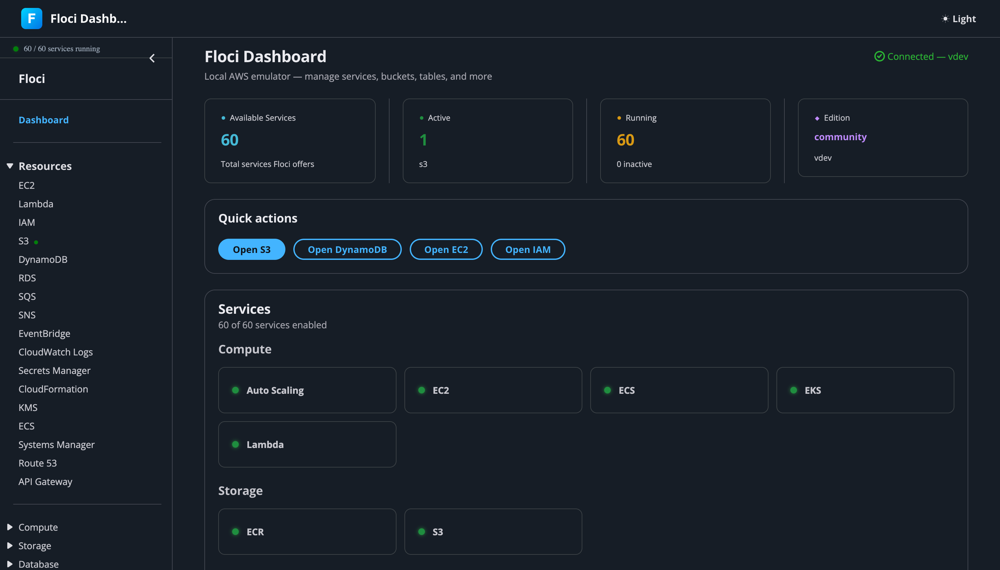

<p align="center">
  
</p>

<h1 align="center">Floci Dash</h1>

<p align="center">
  <strong>AWS Console-style web UI for <a href="https://github.com/hectorvent/floci">Floci</a> — the local AWS emulator.</strong>
</p>

<p align="center">
  
  
  
  
  
  
  <a href="https://codecov.io/gh/ofsazib/floci-dash"></a>
  <br/>
  <a href="https://github.com/ofsazib/floci-dash/pkgs/container/floci-dash"></a>
  <a href="https://github.com/ofsazib/floci-dash/pkgs/container/floci-dash"></a>
  <a href="https://github.com/ofsazib/floci-dash/pkgs/container/floci-dash"></a>
</p>

<p align="center">
  <a href="#features">Features</a> •
  <a href="#quick-start">Quick Start</a> •
  <a href="#usage">Usage</a> •
  <a href="#architecture">Architecture</a> •
  <a href="#supported-services">Services</a> •
  <a href="#development">Development</a> •
  <a href="#contributing">Contributing</a>
</p>

---

---

<p align="center">
  
</p>

## Features

- **AWS Console look and feel** — Built with [Cloudscape Design System](https://cloudscape.design/), the same component library used by the real AWS Management Console
- **62 Floci services** — Full navigation, status, and resource management with 65+ backend routes covering all major AWS services
- **Deep resource management** — Browse, create, and delete resources for implemented services (S3, DynamoDB, EC2, RDS, SQS, SNS, EventBridge, CloudWatch Logs, CloudWatch Metrics, Lambda, IAM, Secrets Manager, CloudFormation, KMS, ECS, SSM, Route 53, API Gateway)
- **EC2 web terminal** — Interactive bash shell inside running EC2 instances directly from the browser (xterm.js + Docker Engine API with PTY)
- **Dark mode** — Toggle between light and dark themes (persisted to localStorage)
- **Configurable Floci endpoint** — Change the Floci URL at runtime from Settings (no restart needed)
- **AWS-aligned sidebar** — Service categories reorganized to match AWS Console navigation (Application Integration, Containers, Management & Governance, etc.)
- **Favorites** — Star any service for quick access; favorites persist in localStorage and appear at the top of the sidebar
- **Recently Visited** — Last 10 visited services shown in the sidebar for quick re-access
- **Combined search** — Sidebar search shows all matching services in one flat list (both implemented and available)
- **Loading skeletons** — Animated skeleton placeholders during data fetches (table rows, stat cards, detail views)
- **Improved empty states** — Consistent empty state component with icon, description, and action hint across all tables and pages
- **Notification bell** — Visual badge in the top nav when services are unhealthy, with a modal listing non-running services
- **Global search** — Search bar in the top nav to quickly find and navigate to any service
- **Dashboard home** — Live stat cards (total/active/running services), resource count summaries per service, quick actions with responsive grid, recent activity feed (localStorage-backed), breadcrumbs, and the full service grid
- **Zero host dependencies** — Everything runs in Docker, no Node.js or AWS CLI needed locally
- **Single container** — One Docker image for the entire dashboard (React SPA + Node.js API)
- **Error boundaries** — React error boundary wrapping the entire app, catches rendering errors gracefully with a recovery message
- **Toast notifications** — Global API error interceptor that surfaces network and server errors via non-intrusive toast notifications
- **Content Security Policy** — Strict CSP headers applied in production (self-only scripts, inline styles allowed for Cloudscape, no inline event handlers)
- **Input sanitization** — All user inputs sanitized on the backend (control character stripping, path traversal prevention, JSON validation, length limits)
- **Docker health checks** — Container health monitoring via `/api/healthz` endpoint, used by Docker Compose for dependency ordering
- **Optimized Docker image** — Multi-stage build with pnpm cache mounts and `pnpm prune --prod` for minimal production image size

## Quick Start

> **Prerequisites:** [Docker](https://docs.docker.com/get-docker/) and [Docker Compose](https://docs.docker.com/compose/install/) (or Docker Desktop)

```bash
git clone https://github.com/ofsazib/floci-dash.git
cd floci-dash
make up-bg
```

Or pull the public Docker image. Two variants are published:

| Image | Tag example | Contains |
|-------|-------------|----------|
| Dashboard only | `ghcr.io/ofsazib/floci-dash:latest` | Dashboard only — pair with external Floci |
| Combined | `ghcr.io/ofsazib/floci-dash:latest-combined` | Floci + Dashboard in one container |

**Tag scheme:** `latest` / `latest-combined` always point at the most recent **stable release** (a `v*` git tag). Every push to `main` also publishes `edge` / `edge-combined` (bleeding-edge) plus an immutable `0.0.<build>` tag. To pin a specific version, use a release tag such as `:1.2.3` (or `:1.2.3-combined`).

```bash
# Dashboard only (needs Floci running separately on :4566)
docker pull ghcr.io/ofsazib/floci-dash:latest
docker run -p 9877:3000 --rm ghcr.io/ofsazib/floci-dash

# Combined (Floci + Dashboard, single container)
docker pull ghcr.io/ofsazib/floci-dash:latest-combined
docker run -p 3000:3000 -p 4566:4566 -v /var/run/docker.sock:/var/run/docker.sock \
  --rm ghcr.io/ofsazib/floci-dash:latest-combined
```

Open [http://localhost:9877](http://localhost:9877) — the dashboard connects to Floci automatically. For the combined image, use [http://localhost:3000](http://localhost:3000).

Floci runs on [http://localhost:9878](http://localhost:9878) (standard LocalStack-compatible endpoint).

That's it. No `pnpm install`, no `.env` files, no AWS credentials.

## Usage

### Common commands

| Command | Description |
|---------|-------------|
| `make up` | Start Floci + Dashboard (foreground, see logs) |
| `make up-bg` | Start in background |
| `make down` | Stop all containers |
| `make logs` | Tail all logs |
| `make logs-dashboard` | Tail dashboard logs only |
| `make rebuild` | Rebuild dashboard image (after code changes) |
| `make ps` | Show container status |
| `make help` | List all available commands |

### Configurable ports

Override with environment variables:

```bash
FLOCI_PORT=4566 DASHBOARD_PORT=3000 make up-bg
```

| Variable | Default | Description |
|----------|---------|-------------|
| `FLOCI_PORT` | `9878` | Host port for Floci |
| `DASHBOARD_PORT` | `9877` | Host port for Dashboard |

### Data persistence

> **The dashboard is stateless** — it stores nothing itself. Every bucket, table, queue, etc. lives inside **Floci**. Data persistence is therefore entirely a Floci setting.

**Default behavior:** Out of the box, Floci runs in **in-memory mode** (`FLOCI_STORAGE_MODE=memory`) — fast, but **all data is lost when the Floci container stops or restarts**. This is why a created S3 bucket disappears after recreating the container.

This `docker-compose.yml` overrides that default to **`hybrid`** and mounts a named volume (`floci-data`) at Floci's data path, so your resources survive restarts:

```yaml
floci:
  environment:
    - FLOCI_STORAGE_MODE=hybrid     # survives restarts
  volumes:
    - floci-data:/app/data          # durable storage
```

Pick a mode with the `FLOCI_STORAGE_MODE` env var:

| Mode | Durability | Notes |
|------|-----------|-------|
| `memory` | ❌ none (Floci default) | In-memory only; lost on stop/restart |
| `hybrid` | ✅ survives restarts | In-memory speed, async flush to disk every ~5s (**this repo's default**) |
| `persistent` | ✅✅ flush on every write | Safest, slightly slower |
| `wal` | ✅✅✅ write-ahead log | Highest durability |

```bash
# Override the mode at launch
FLOCI_STORAGE_MODE=persistent make up-bg
```

> ⚠️ **`make down` keeps your data** (it only stops containers — the `floci-data` volume survives). **`make clean-all` deletes it** (it runs `docker compose down -v`, removing volumes). Use `down`, not `clean-all`, when you want to keep state.

For the **combined image**, set the mode and mount a volume yourself:

```bash
docker run -p 3000:3000 -p 4566:4566 \
  -e FLOCI_STORAGE_MODE=hybrid -v floci-data:/app/data \
  -v /var/run/docker.sock:/var/run/docker.sock \
  --rm ghcr.io/ofsazib/floci-dash:latest-combined
```

(For LocalStack compatibility, Floci also accepts `PERSISTENCE=1`, which it auto-translates to `FLOCI_STORAGE_MODE=persistent`.)

## Architecture

```
┌─────────────────────────────────────────────────┐
│                   Browser                        │
│         Floci Dash (React SPA)              │
│      Cloudscape Design + TanStack Query          │
└──────────────────┬──────────────────────────────┘
                   │ /api/*
┌──────────────────▼──────────────────────────────┐
│              Dashboard Backend                    │
│           Node.js 22 + Hono (port 3000)          │
│                                                  │
│  /api/system/*   → Floci health/info (HTTP)      │
│  /api/inspect/*  → SQS/SES/SNS inspection        │
│  /api/active     → Resource detection             │
│  /api/aws/*      → AWS SDK calls → Floci         │
│                                                  │
│  Serves built React SPA in production            │
└──────────────────┬──────────────────────────────┘
                   │ AWS SDK / HTTP
┌──────────────────▼──────────────────────────────┐
│              Floci (port 4566)                    │
│          Local AWS services emulator              │
│        ghcr.io/hectorvent/floci:latest           │
└─────────────────────────────────────────────────┘
```

### Testing

The project includes **~3,167 tests** (2,873 unit + 294 integration) across 177 test files, organized as:

| Tests | Count | Location |
|-------|-------|----------|
| Backend route unit tests | 46 files | `src/backend/routes/aws/*.test.ts` |
| Frontend page/component tests | 44 files | `src/frontend/pages/*.test.tsx`, `src/frontend/components/*.test.tsx` |
| Frontend hook tests | 34 files | `src/frontend/hooks/*.test.ts` |
| Other tests | 53 files | shared libs, stores, types, etc. |
| Integration tests | 294 | `src/backend/integration.test.ts` (requires Floci) |

```bash
make test           # Fast unit tests (no Floci needed)
make test-cov       # Unit tests with coverage report
make test-all       # Unit + integration tests (requires Floci service container)
```

### Key design decisions

- **Backend proxies all AWS calls** — The browser never imports `@aws-sdk/client-*`. All AWS SDK calls go through the Hono backend, which forwards them to Floci.
- **Service-based vertical slices** — Each AWS service has its own backend route file (`src/backend/routes/aws/{service}.ts`) and frontend hooks (`src/frontend/hooks/use{Service}.ts`).
- **Shared components** — `ResourceTable`, `CreateModal`, `DeleteButton`, `ServiceCard`, etc. are reused across all services.
- **Dynamic navigation** — The sidebar is built from Floci's `/_floci/health` API, so it only shows services Floci actually supports.

### Project structure

```
src/
  frontend/                React 19 SPA (Vite)
    components/            Shared UI components
      AppLayoutShell.tsx   Main layout + navigation
      ServiceGrid.tsx      Dashboard home service cards
      ResourceTable.tsx    Generic table with pagination
      CreateModal.tsx      Generic create resource modal
      DeleteButton.tsx     Generic delete with confirmation
      StatCard.tsx         Dashboard stat cards
      StatusBadge.tsx      Service status badges
      EmptyState.tsx       Empty state with icon, title, description, action
      LoadingSkeleton.tsx  Animated skeleton placeholders
      ErrorBoundary.tsx    React error boundary (catches render errors)
      Toast.tsx            Toast notification component
      DynamoDBTableDetail.tsx  DynamoDB item browser
      DynamoDBAdvanced.tsx DynamoDB advanced features (GSIs, TTL, tags, PartiQL)
      S3BucketConfig.tsx   S3 bucket configuration (11 tabs)
      EC2Terminal.tsx       EC2 web terminal (xterm.js + WebSocket)
    pages/                 Route pages
      DashboardHome.tsx    Home with stats + service grid
      S3Page.tsx           Dedicated S3 browser
      EC2Page.tsx          EC2 resource manager + terminal
      SQSPage.tsx          SQS queue manager
      SNSPage.tsx          SNS topic manager
      EventsPage.tsx       EventBridge manager
      LambdaPage.tsx       Lambda functions, layers, invoke, versions/aliases
      CloudWatchPage.tsx   CloudWatch metrics, alarms, statistics
      IAMPage.tsx          IAM users, roles, policies, groups
      SecretsManagerPage.tsx  Secrets Manager secrets, values, versions
      CloudFormationPage.tsx  CloudFormation stacks, resources, events, templates
      KMSPage.tsx           KMS keys, aliases, grants, crypto playground
      ServicePage.tsx      Dynamic service pages
      Settings.tsx         Dark mode, refresh interval
    hooks/                 TanStack Query hooks
      useS3.ts             S3 operations
      useS3Config.ts       S3 bucket config
      useDynamoDB.ts       DynamoDB operations
      useDynamoDBAdvanced.ts  DynamoDB advanced ops
      useEC2.ts            EC2 operations
      useRDS.ts            RDS operations
      useSQS.ts            SQS operations
      useSNS.ts            SNS operations
      useEvents.ts         EventBridge operations
      useLambda.ts         Lambda operations
      useCloudWatch.ts     CloudWatch metrics + alarms operations
      useIAM.ts            IAM operations
      useSecrets.ts        Secrets Manager operations
      useCloudFormation.ts CloudFormation operations
      useKMS.ts            KMS operations
      useECS.ts            ECS operations
      useSSM.ts            SSM Parameter Store operations
      useRoute53.ts        Route 53 DNS operations
      useAPIGateway.ts     API Gateway REST API operations
      useAppSync.ts        AppSync GraphQL API operations
      useScheduler.ts      EventBridge Scheduler operations
      useService.ts        Generic service hook
      useSystem.ts         Health, active services
      useActivityFeed.ts   Dashboard activity feed (localStorage)
      useResourceCounts.ts Resource count summaries
    lib/                   Utilities
      client.ts            Fetch wrapper
      utils.ts             Helpers
    stores/                Zustand stores
      settings.ts          UI settings
    types/                 TypeScript types
      api.ts               API response types
      services.ts          Service labels + categories

  backend/                 Node.js 22 + Hono
    clients/
      floci.ts             HTTP proxy to Floci
      aws.ts               AWS SDK client factory
      sanitize.ts          Input sanitization utilities
    routes/
      system.ts            /api/system/health, /init
      inspection.ts        /api/inspect/sqs, /ses, /sns
      active.ts            /api/active
      aws/
        index.ts           Route aggregator
        s3.ts              S3 bucket CRUD
        s3-objects.ts      S3 object operations
        s3-config.ts       S3 bucket configuration
        dynamodb.ts        DynamoDB table/item CRUD
        dynamodb-advanced.ts  DynamoDB advanced ops
        rds.ts             RDS operations
        ec2.ts             EC2 operations (81 endpoints)
        ec2-terminal.ts    EC2 web terminal (WebSocket + Docker API)
        sqs.ts             SQS operations
        sns.ts             SNS operations
        events.ts          EventBridge operations
        lambda.ts          Lambda operations
        cloudwatch.ts      CloudWatch metrics + alarms operations
        iam.ts             IAM operations
        secretsmanager.ts  Secrets Manager operations
        cloudformation.ts  CloudFormation operations
        kms.ts             KMS operations
        ecs.ts             ECS operations
        ssm.ts             SSM Parameter Store operations
        route53.ts         Route 53 DNS operations
        apigateway.ts      API Gateway REST API operations
        appsync.ts         AppSync GraphQL operations
        scheduler.ts       EventBridge Scheduler operations
        sts.ts             STS identity and session operations
    index.ts               Hono app entry point
    types.ts               Shared backend types

  test/                    Shared test infrastructure
    setup.ts              Vitest global setup (jest-dom matchers)
    helpers.tsx           Shared test utilities (wrapper, mocks, route helpers)
    backend/              Backend route unit tests (*.test.ts)
    frontend/             Frontend page component tests (*.test.tsx)
```

## Supported Services

### Fully implemented

These services have full CRUD operations in both backend and frontend:

| Service | Operations |
|---------|------------|
| **S3** | List buckets, create/delete bucket, list objects, upload (multipart), download, delete objects, **multi-select batch delete**, **recursive folder delete**, bucket configuration |
| **DynamoDB** | List tables, create/delete table, scan items, query, filter, put item, delete item |
| **RDS** | List/create/delete/modify/reboot DB instances, list/create/delete DB clusters, list/create/delete parameter groups & cluster parameter groups, view/modify parameters |
| **EC2** | 13 resource types: Instances (run/start/stop/reboot/terminate, **web terminal** via Docker Engine API with PTY), VPCs (CIDR association, endpoints), Subnets, Security Groups (ingress/egress rules), Key Pairs (import), AMIs, Tags, Internet Gateways (attach/detach), Route Tables (routes, subnet association), NAT Gateways, Elastic IPs (associate/disassociate), Launch Templates (versions), Volumes, Regions/AZs, Instance Types, Network Interfaces |
| **SQS** | List queues, create (standard/FIFO, attributes, tags), delete, view messages (via inspection API), send message (single/batch, FIFO group/dedup), delete message, purge queue, get/set attributes, tags CRUD, dead letter source queues |
| **SNS** | List topics, create (standard/FIFO, display name, tags), delete, get/set attributes, subscriptions (subscribe/unsubscribe, 7 protocols), publish message (single, FIFO group/dedup), tags CRUD, platform applications (list, create, delete), platform endpoints (list, create, delete), SMS inbox + push notification inspection viewers |
| **EventBridge** | Event buses (list, create, delete), rules (list, create with schedule/event pattern, delete, enable/disable toggle), targets (add/remove per rule), send events (PutEvents), archives (list, create, delete), replays (list) |
| **CloudWatch Logs** | Log groups (list, create, delete, retention policy), log streams (list, create, delete), log events (live viewer with auto-refresh/auto-scroll/limit selector, put events), subscription filters (list, create, delete), tags CRUD |
| **Lambda** | Functions (list, create with zip/S3 code, delete, get configuration, update config, update code), invoke (sync/async/dry-run with response viewer), versions (list, publish), aliases (list, create, delete), event source mappings (list, delete), layers (list versions, delete), function URL config, concurrency config, tags |
| **CloudWatch** | Metrics (list, put metric data, get statistics with sparkline charts), alarms (list, create with threshold/comparison/statistic, delete, set state OK/ALARM), tags |
| **IAM** | Users (list, create, delete, detail with groups/policies/access keys, create access keys), roles (list, create, delete, detail with trust policy/attached policies/tags), groups (list, create, delete), policies (list by scope, create, delete, detail with version document viewer), instance profiles (list) |
| **Secrets Manager** | Secrets (list, create with value, delete, restore, detail with value reveal/version history), put secret value (new versions), random password generator |
| **CloudFormation** | Stacks (list, create with YAML/JSON template, delete, detail with outputs/parameters/tags), resources (per-stack list with status), events (timeline with status), template viewer, template validator, exports |
| **KMS** | Keys (list, create with usage/spec, detail with state/rotation/aliases/grants/tags), key management (enable/disable, schedule/cancel deletion, rotation toggle, update description), crypto playground (encrypt/decrypt), aliases (list, create, delete), data key generation, random bytes |
| **ECS** | Clusters (list, create, delete, detail with running task/service counts), task definitions (list, describe, deregister), services (list, delete per cluster), tasks (list by status, run, stop), container instances (list, describe) |
| **SSM** | Parameter Store (list, create with type/description/overwrite, delete, detail with value reveal, version history), tags (list, add, remove) |
| **Route 53** | Hosted zones (list, create with domain name/comment, delete, detail with record set count), resource record sets (list, create with type/TTL/value, delete per name+type), health checks (list) |
| **API Gateway** | REST APIs (list, create with name/description, delete, detail), resources (list with methods per resource), deployments (list with stage/status) |
| **AppSync** | GraphQL APIs (list, create with auth type, delete, detail), data sources (list, create with type/description, delete), resolvers (list with field/type/kind/runtime), functions (list, create with data source, delete), API keys (list, create, delete with expiry), types (list), schema (get/status/start creation) |
| **EventBridge Scheduler** | Schedule groups (list, create, delete with schedule count), schedules (list, create with expression/target/role, delete) |
| **ECR** | Repositories (list, create, delete), images (list with details, batch delete), repository policy (get/set/delete), lifecycle policy (get/set) |
| **ELB** | Load balancers (list, create, delete, attributes), target groups (list, create, delete), listeners (list, create, delete), target health, register/deregister targets |
| **SES** | Email identities (list with verification/DKIM/mail-from status, verify email, verify domain, delete), send email (to/cc/bcc with HTML/text), verified emails list |
| **STS** | Caller identity (account, user ID, ARN), assume role (with session name/duration/policy, returns temporary credentials), get session token (with MFA/duration) |
| **EKS** | Clusters (list, create, delete, describe with status/version/endpoint), node groups (list, create, delete, describe with scaling config/instance types/subnets) |
| **Auto Scaling** | Auto Scaling Groups (list, create, update, delete, set desired capacity), launch configurations (list), scaling policies (list per ASG), scaling activities (list per ASG) |
| **CloudFront** | Distributions (list, get, create, update, delete with ETag), invalidations (list, create, get per distribution), cache policies (list), origin access controls (list), functions (list), tags (list per resource) |
| **Kinesis** | Streams (list with summaries, describe, create, delete), shards (list per stream), consumers (list per stream), records (put single, put batch, get via shard iterator), tags (list per stream) |
| **Neptune** | Clusters (list, describe, create, delete), instances (list, describe, create with cluster attachment, delete) |
| **EventBridge Pipes** | Pipes (list, describe, create, update, delete, start, stop with state management) |
| **Cognito** | User pools (list, describe, create, delete), users (list, admin create, delete, enable, disable, set password), groups (list, create, delete), app clients (list, describe, create, delete) |
| **API Gateway V2** | APIs (list, get, create, delete), routes (list, create, delete), integrations (list, create, delete), stages (list, create, delete), deployments (list, create, delete) with drill-down per API |
| **ACM** | Certificates (list, describe with validation details, request, delete, get PEM), tags (list per certificate) |
| **CloudTrail** | Trails (list, create, update, delete), start/stop logging, get trail status |
| **AWS Config** | Config rules (list, create, delete), configuration recorders (list, create, start/stop, status), delivery channels (list, create), conformance packs (list, create, delete) |
| **AppConfig** | Applications (list, get, create, delete), environments (list, create, delete per app), configuration profiles (list, create, delete per app), hosted config versions (list per profile) |
| **Cloud Map** | Namespaces (list, get, create HTTP, delete), services (list filtered by namespace, get, create, delete), instances (list per service) with drill-down navigation |
| **Athena** | Work groups (list, create, delete), query executions (list, get, stop), data catalogs (list, get), databases (list), table metadata (list per database) |
| **Glue** | Databases (list, get, create, delete), tables (list, get, create, delete per database) with drill-down navigation |
| **Firehose** | Delivery streams (list with describe, get, create, delete), put record/batch, tags (list per stream) |
| **Step Functions** | State machines (list, describe, create, delete), executions (list, describe, start, stop, history), activities (list) with drill-down per state machine |
| **OpenSearch** | Domains (list, describe, create, delete), versions (list) |
| **MSK** | Clusters (list, describe, create, delete V2 API), bootstrap brokers (get per cluster) |
| **Bedrock Runtime** | Converse (messages → response), invoke model (prompt → response) with configurable model IDs |
| **Textract** | Sync detect document text, sync analyze document (with feature types), async start/get document text detection, async start/get document analysis |
| **Transcribe** | Transcription jobs (list, get, start, delete), vocabularies (list) |
| **Cost Explorer** | Get cost & usage, dimension values, tags, reservation coverage/utilization, savings plans coverage/utilization, cost categories — all as interactive POST queries |
| **Pricing** | List services, get attribute values per service, list products with filters, list price lists, get price list file URL |
| **Resource Groups Tagging** | List tagged resources (with tag/value filters), tag/untag resources by ARN, list tag keys and values |
| **Cost & Usage Report (cur)** | Report definitions (list, create, modify, delete), tags (list, add, remove) |
| **BCM Data Exports** | Exports (list, create, get, update, delete), executions (list per export), tables (list), tags (list, add, remove) |
| **CodeBuild** | Projects (list, create, delete, get), builds (start, list per project, list all, get, stop), source credentials (list, import, delete), curated environment images (list) |
| **CodeDeploy** | Applications (list, create, get, update, delete), deployment groups (list, create, get, delete per application), deployment configs (list, create, get, delete), deployments (create, list per application, get), tags (list, add, remove per resource) |
| **Backup** | Backup plans (list, create, get, delete), backup vaults (list, create, describe, delete), backup selections (list, create per plan, get, delete), backup jobs (list, start, describe, stop), tags (list) |
| **Transfer Family** | Servers (list, create, describe, delete, start, stop), users (list per server, create, describe, delete), tags (list) |
| **AWS Batch** | Compute environments (list, create, describe, delete), job queues (list, create, describe, delete), job definitions (list, register, describe, deregister), jobs (list, describe, submit, terminate) |
| **DocumentDB** | DB clusters (list, describe, create, delete, modify), DB instances (list, describe, create, delete, modify) |
| **Amazon EMR** | Clusters (list, create via RunJobFlow, describe, terminate, modify, termination protection), steps (list, add, describe, cancel per cluster), instance groups (list, add), instance fleets (list, add), instances (list), security configurations (list, create, describe, delete), tags (add, remove per cluster) |
| **RDS Data API** | Execute SQL statements, begin/commit/rollback transactions |
| **WAF v2** | Web ACLs, IP Sets, Regex Pattern Sets, Rule Groups (list, create, delete) |
| **ElastiCache** | Replication groups (list, create, describe, delete), cache clusters (list, create, describe, delete), users (list, create, describe, delete) |
| **MemoryDB** | Clusters (list, create, describe, delete), tags (list per resource) |

### Navigation + status (62 services)

All services reported by Floci appear in the sidebar with status indicators.

<details>
<summary>Full list of navigable services</summary>

**Compute:** EC2, ECS, EKS, Auto Scaling, Lambda, AWS Batch
**Storage:** S3, ECR
**Database:** DynamoDB, DocumentDB, ElastiCache, MemoryDB, Neptune, RDS, RDS Data API
**Networking:** API Gateway, API Gateway V2, AppSync, CloudFront, ELB, Route 53
**Messaging:** EventBridge (Events), EventBridge Pipes, EventBridge Scheduler, Kinesis, Kinesis Firehose, SES, SNS, SQS
**Security:** ACM, Cognito, IAM, KMS, Secrets Manager, WAF v2
**Management:** AppConfig, AppConfig Data, CloudFormation, CloudTrail, CloudWatch Logs, CloudWatch Metrics, Config, Service Discovery (Cloud Map), SSM (Systems Manager)
**Analytics:** Athena, Glue, MSK (Kafka), OpenSearch, Step Functions, Amazon EMR
**ML/AI:** Bedrock Runtime, Textract, Transcribe
**Billing:** BCM Data Exports, Cost Explorer, Cost & Usage Report, Pricing, Resource Groups Tagging
**Developer Tools:** CodeBuild, CodeDeploy
**Migration:** Backup, Transfer Family

</details>

## Development

### With Docker (recommended)

```bash
# Start the stack
make up-bg

# After making code changes, rebuild
make rebuild

# View logs
make logs-dashboard

# Stop
make down
```

### Native (requires Node.js 22+)

```bash
make setup          # install + typecheck
make dev            # start both frontend and backend
make typecheck      # check types
make build          # production build
```

You'll need Floci running separately (e.g., `docker run -p 4566:4566 ghcr.io/hectorvent/floci:latest`).

### Adding a new service

1. Check Floci source for supported operations: `../floci/src/main/java/io/github/hectorvent/floci/services/{service}/`
2. Create backend routes: `src/backend/routes/aws/{service}.ts`
3. Register in `src/backend/routes/aws/index.ts`
4. Create frontend hooks: `src/frontend/hooks/use{Service}.ts`
5. Add component to `src/frontend/pages/ServicePage.tsx`
6. Write tests: backend route tests (`src/backend/routes/aws/{service}.test.ts`) and frontend page tests (`src/frontend/pages/{Service}Page.test.tsx`)
7. Run `make typecheck && make test` to verify
8. Update PLAN.md tracker and README.md

## Tech Stack

| Layer | Technology |
|-------|-----------|
| Language | TypeScript 5.x |
| Frontend | React 19, Vite 6 |
| UI Components | Cloudscape Design System 3.x |
| Data Fetching | TanStack Query 5 |
| State | Zustand 5 |
| Routing | React Router 7 (HashRouter) |
| Backend | Hono 4, Node.js 22 |
| AWS SDK | @aws-sdk/client-v3 |
| Infra | Docker, Docker Compose |

## Environment Variables

| Variable | Default | Description |
|----------|---------|-------------|
| `FLOCI_URL` | `http://localhost:4566` | Floci endpoint URL (auto-set in Docker; can also be changed at runtime via Settings) |
| `AWS_REGION` | `us-east-1` | Default AWS region |
| `PORT` | `3000` | Dashboard backend port (inside container) |
| `NODE_ENV` | `production` | Node environment |
| `FLOCI_PORT` | `9878` | Host port for Floci (docker-compose) |
| `DASHBOARD_PORT` | `9877` | Host port for Dashboard (docker-compose) |
| `FLOCI_STORAGE_MODE` | `hybrid` (this repo) / `memory` (Floci default) | Floci storage mode — see [Data persistence](#data-persistence) |

## License

This project is licensed under the MIT License — see the [LICENSE](LICENSE) file for details.

## Related

- **[Floci](https://github.com/floci-io/floci)** — The local AWS emulator this dashboard manages
- **[Cloudscape Design System](https://cloudscape.design/)** — AWS open-source design system

## Contributing

Contributions are welcome! Please feel free to submit a Pull Request.

1. Fork the repository
2. Create your feature branch (`git checkout -b feature/amazing-feature`)
3. Commit your changes (`git commit -m 'Add amazing feature'`)
4. Push to the branch (`git push origin feature/amazing-feature`)
5. Open a Pull Request
